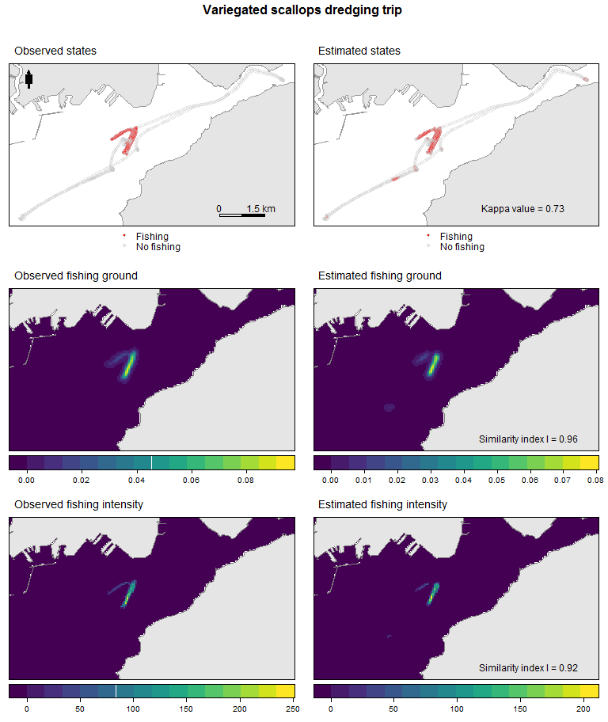

Reproducing the method evaluation
================
Damien Le Guyader
2016-07-11

``` r
# script to reproduce mss Fig 2. 
#
# Le Guyader,D., C. Ray, D. Brosset, F. Gourmelon.
# Defining high resolution fishing grounds with Automatic Identification System (AIS)
# Submitted to ICES Marine Science the xx,cc 2016


library(sp)
library(raster)
library(rasterVis)
library(rgdal) 
library(rgeos)
library(spatstat)
library(maptools)
library(SDMTools)
library(adehabitatLT)
library(trip)
library(mclust)
library(ggplot2)
library(plyr) 
library(dplyr)
library(caret) 
library(viridis)
library(grid)
library(gridExtra)
```

``` r
######################## Parameters #

dtm <- 600  # maximimum duration allowed between 2 positions(in second)
lhsv <- 47  # grid size: here we use the grid size caculated (in meter)
# for the 2011-2012 season(see paper for details)
maille <- 50  # smoothing factor (in meter): idem (see paper for details) 


######################## Import data #

td <- getwd()
# GPS data for the variegated scallop fishing trip have been anonymized and 
# coordinates have been modified with a vectorial translation for confidentiality matters
pet <- read.csv2(file = paste0(td, "/data/DataTripOneAnon.csv"))
coordinates(pet) <- ~coords.x + coords.y  # To SPDF
proj4string(pet) <- CRS("+init=epsg:2154")
pet$time <- as.POSIXct(pet$time, tz = "UTC")  # set time to POSIXct format


e <- extent(pet) + 2000
# Create the clipping polygon à partir des position peche (e: extent)
CP <- as(e, "SpatialPolygons")
proj4string(CP) <- CRS("+init=epsg:2154")

# get coastline data and clip to data extent

land <- readOGR(dsn = paste0(td, "/data"), layer = "land")
```

    ## OGR data source with driver: ESRI Shapefile 
    ## Source: "C:/Users/Damien/Documents/GitHub/AIS_FihingGrounds_mss2/data", layer: "land"
    ## with 2617 features
    ## It has 2 fields

``` r
land <- spTransform(land, CRS("+init=epsg:2154"))
land <- gIntersection(land, CP, byid = TRUE)

# get sea shape data and clip to data extent
sea <- readOGR(dsn = paste0(td, "/data"), layer = "sea")
```

    ## OGR data source with driver: ESRI Shapefile 
    ## Source: "C:/Users/Damien/Documents/GitHub/AIS_FihingGrounds_mss2/data", layer: "sea"
    ## with 1 features
    ## It has 1 fields

``` r
sea <- spTransform(sea, CRS("+init=epsg:2154"))
sea <- gIntersection(sea, CP, byid = TRUE) 


# 1 - Estimates of fishing activity #######################

## Data cleaning: time filter
prep.fun <- function(x, dtmax, analyse) {
  # Fonction to calculate ditance (dist) between consécutive points, time
  # duration (dt), mean speed (vmoy) and deletion according to dtmax x :
  # the SPDF dtmax: maximimum duration allowed between 2 positions(in
  # second), analyse: name of the metier (character string)
  df <- x
  # conversion to ltraj class
  d.ltraj <- as.ltraj(coordinates(df), df$time, id = paste(analyse))
  ld.ltraj <- ld(d.ltraj)  # ltraj to data.frame class
  df$dist <- ld.ltraj$dist
  df$dt <- ld.ltraj$dt
  df <- subset(df, !is.na(df$dt))  # NA delete
  df <- subset(df, df$dt < dtmax)  ## dt>dtmax delete
  df$vmoy <- df$dist/df$dt  # Mean speed calculation
  return(df)
}

pet.pt <- prep.fun(x=pet, dtmax=dtm, analyse="Varieg. scall") 


densy <- densityMclust(pet.pt$vmoy)
densy$modelName  # Optimal model
```

    ## [1] "V"

``` r
densy$G  # Optimal number of cluster according to the BIC value
```

    ## [1] 4

``` r
CLUSTCOMBI <- clustCombi(pet.pt$vmoy)
# entPlot(CLUSTCOMBI$MclustOutput$z, CLUSTCOMBI$combiM, abc = 'normalized') 
## No elbow in the NDE value, so we get the optimal number
## of cluster according to the BIC value

## Final classification
yclust <- Mclust(pet.pt$vmoy, modelNames = densy$modelName, G = densy$G)
## We get G = 4 as we see no elbow in the NDE value

## Get classification values
pet.pt$CLUST <- yclust$classification

## Synthesis 
# ddply(data.frame(pet.pt), 'CLUST', summarise, min= min(vmoy), max= max(vmoy))

## Quick cluster plot 
# qplot(vmoy, data = data.frame(pet.pt),
#       geom = 'density', fill = factor(CLUST), alpha = I(0.8))

## Set classification (1) for estimated fishing positions and (0) for
## estimated non fishing positions given the selected cluster(s)
fishSet.fun <- function(x, minClus, maxClus) {
  # minClus: identifier for the minimum speed cluster (integer) maxClus:
  # identifier for the maximum speed cluster (integer)
  vmin.clust <- NULL
  max.clust <- NULL
  vmin.clust <- min(x$vmoy[x$CLUST == minClus])
  vmax.clust <- max(x$vmoy[x$CLUST == maxClus])
  x$estim <- 0  # transit par défaut
  x[x$vmoy >= vmin.clust & x$vmoy <= vmax.clust, "estim"] <- 1  # pêche
  x$act_estim <- "NO"  # transit par défaut
  # data.frame(df[df$vmoy>=vmin.clust & df$vmoy <=vmax.clust ,])
  x[x$vmoy >= vmin.clust & x$vmoy <= vmax.clust, "act_estim"] <- "FISH"  # pêche
  x$act_estim <- factor(x$act_estim)
  return(x)
}

pet.pt <- fishSet.fun(pet.pt, minClus = 2, maxClus = 2)

rm(densy, CLUSTCOMBI, yclust)

confMat <- confusionMatrix(table(pet.pt$act_estim, pet.pt$act_obs))  # Confusion matrix


# 2 - Fishing grounds ###############################################

## Data preparation Observed Values
val.obs <- subset(data.frame(pet.pt), select = c(coords.x, coords.y, time, id, obs))
names(val.obs) <- c("x", "y", "date", "id", "statut")

# Estimated Values
val.est <- subset(data.frame(pet.pt), select = c(coords.x, coords.y, time, id, estim))
names(val.est) <- c("x", "y", "date", "id", "statut")

# Preparation for trip format coercion
fun.group <- function(x) {
  x %>% arrange(id, date) %>% 
    mutate(gap = c(0, (diff(statut) != 0) * 1)) %>% 
    mutate(group = cumsum(gap) + 1)
}

val.obs <- ddply(val.obs, .(id, as.Date(date)), .fun = fun.group)
val.est <- ddply(val.est, .(id, as.Date(date)), .fun = fun.group)

val.obs$mmsi <- val.obs$id
val.obs$id <- paste(val.obs$mmsi, as.integer(as.Date(val.obs$date)), val.obs$group, sep = "_")
val.est$mmsi <- val.est$id
val.est$id <- paste(val.est$mmsi, as.integer(as.Date(val.est$date)), val.est$group, sep = "_")

val.obs <- val.obs %>%
  filter(statut == 1) %>% # get only fishing positions
  dplyr::select(x,y,date,id)  

val.est <- val.est %>% 
  filter(statut == 1) %>%   
  dplyr::select(x,y,date,id)

# Trip format calculation
lenst.obs <- tapply(val.obs$id, val.obs$id, length)
# delete non-consecutives fishing positions
val.obs <- val.obs[val.obs$id %in% names(lenst.obs)[lenst.obs > 2], ]

lenst.est <- tapply(val.est$id, val.est$id, length)
val.est <- val.est[val.est$id %in% names(lenst.est)[lenst.est > 2], ]

# Observed fishing positions to trip format
coordinates(val.obs) <- ~x + y
proj4string(val.obs) <- CRS("+init=epsg:2154")
trip.obs <- trip(val.obs, c("date", "id"))

# Estimated fishing positions to trip format
coordinates(val.est) <- ~x + y
proj4string(val.est) <- CRS("+init=epsg:2154")
trip.est <- trip(val.est, c("date", "id"))

pet.est <- trip.est
pet.obs <- trip.obs
rm(trip.est, trip.obs, val.obs, val.est)


## Function to compute KDE line density

fishGround.fun <- function(fishTrip, sea, grid, h) {
  # fishTrip : fishing positions coerced to trip format sea: sea clip to extent of
  # data grid, h: grid size and smoothing factor
  
  # 1- Data preparation
  owin.sea <- as(sea, "owin")  # Window owin
  bif <- raster(sea, resolution = maille)  # Create template raster
  projection(bif) <- CRS("+init=epsg:2154")
  bif <- raster::mask(x = bif, mask = sea)
  
  # 2 - compute KDE line density
  t.obs <- fishTrip
  t.obs$jour <- as.Date(t.obs$date)
  vv.obs <- sort(unique(as.Date(t.obs$date)))
  psp.obs.tx <- as.psp(t.obs)  # coerce to psp format
  psp.obs.tx$window <- owin.sea  # affect owin
  # KDE line density
  dk.lx.obs <- density(psp.obs.tx, sigma = lhsv, dimyx = c(nrow(bif), ncol(bif)))
  dk.obs <- raster(dk.lx.obs)  # Raster conversion
  projection(dk.obs) <- CRS("+init=epsg:2154")
  return(dk.obs)
}

## Computation
pet.dk.obs <- fishGround.fun(fishTrip = pet.obs, sea = sea, grid = maille, h = lhsv)
pet.dk.est <- fishGround.fun(fishTrip = pet.est, sea = sea, grid = maille, h = lhsv)


# 3 Fishing Intensity ################################


## Function to compute fishing time spent
fishInt.fun <- function(fishTrip, sea, grid) {
  # fishTrip : fishing positions coerced to trip format sea: sea clip to
  # extent of data grid size: see the paper
  
  owin.sea <- as(sea, "owin")  #Window owin
  bif.trip <- raster(sea, resolution = grid)
  bif.trip[] <- round(runif(nrow(bif.trip) * ncol(bif.trip)) * 100)
  bif.trip <- raster::mask(bif.trip, sea)
  bif.trip.grid <- as(bif.trip, "SpatialGridDataFrame")
  bif.trip.gt <- getGridTopology(bif.trip.grid)  # Create empty grid
  tripgrid <- tripGrid(fishTrip, grid = bif.trip.gt, method = "pixellate")  # compute time spent
  time.t <- raster(tripgrid)
  projection(time.t) <- CRS("+init=epsg:2154")
  time.est <- raster::mask(time.t, sea)
  return(time.est)
}

# Calculation
pet.time.obs <- fishInt.fun (fishTrip = pet.obs, sea = sea, grid = maille)
pet.time.est <- fishInt.fun (fishTrip = pet.est, sea = sea, grid = maille)


#  4- Warren's similarity index ###############################

# Function
evalMeth.fun <- function(x, y) {
  # x and y are rasters obs and estim
  asc.est <- asc.from.raster(x)
  asc.obs <- asc.from.raster(y)
  # ensure all data is positive
  asc.est = abs(asc.est)
  asc.obs = abs(asc.obs)
  # calculate the I similarity statistic for Quantifying Niche Overlap
  I = Istat(asc.est, asc.obs)
  print(I)
}

# Get Values
pet.ground.eval <- evalMeth.fun (pet.dk.obs, pet.dk.est)
```

    ## [1] 0.9600253

``` r
pet.intens.eval <- evalMeth.fun (pet.time.obs, pet.time.est)
```

    ## [1] 0.9232937

``` r
#  5- Maps ###############################

basemap <- list("sp.polygons", land, fill = "gray90", col = "gray60", lwd = 1)
north <- list("SpatialPolygonsRescale", layout.north.arrow(type = 1), 
              offset = c(146100, 6835650), scale = 600)
scale <- list("SpatialPolygonsRescale", layout.scale.bar(), scale = 1500, 
              offset = c(152600, 6831350), fill = c("transparent", "black"))
text1 <- list("sp.text", c(152600, 6831650), "0")
text2 <- list("sp.text", c(154000, 6831650), "1.5 km")


ext.x <- c(extent(pet.pt)[1], extent(pet.pt)[2])
ext.y <- c(extent(pet.pt)[3], extent(pet.pt)[4])

valKappa <- list("sp.text", c(152600, 6831650), 
                 paste0("Kappa value = ", round(confMat$overall[2], 2)))

p1 <- spplot(pet.pt, "act_obs", col.regions= c("red", 'transparent'),edge.col='grey80', 
             alpha=0.5,cex = 0.5,lwd=0.8,legendEntries = c("Fishing", "No fishing"),
             key.space= "bottom",
             par.settings=list(fontsize=list(text=9)), 
             sp.layout=list(basemap, north,scale, text1,text2),
             main = list(label="Observed states", 
                         font = 1,just = "left",x = grid::unit(5, "mm")))

p2 <-spplot(pet.pt, "act_estim", col.regions= c("red", 'transparent'),edge.col='grey80',
            alpha=0.5,cex = 0.5,lwd=0.8,legendEntries = c("Fishing", "No fishing"),
            key.space= "bottom",
            par.settings=list(fontsize=list(text=9)),
            sp.layout=list(basemap, valKappa),
            main = list(label="Estimated states", 
                        font = 1,just = "left",x = grid::unit(5, "mm")))

p3 <- levelplot(pet.dk.obs, xlim=ext.x,ylim=ext.y,margin=FALSE, xlab=NULL, ylab=NULL,
                scales=list(draw=FALSE),col.regions = viridis, colorkey = list(space="bottom"),
                main=list(label="Observed fishing ground", 
                          font = 1,just = "left",x = grid::unit(5, "mm")), 
                par.settings=list(fontsize=list(text=9))) +
  latticeExtra::layer(sp.polygons(land, fill= "gray90", col="gray50"))

p4 <- levelplot(pet.dk.est,xlim=ext.x,ylim=ext.y, margin=FALSE, xlab=NULL, ylab=NULL,
                scales=list(draw=FALSE),col.regions = viridis, colorkey = list(space="bottom"),
                main=list(label="Estimated fishing ground", 
                          font = 1,just = "left",x = grid::unit(5, "mm")), 
                par.settings=list(fontsize=list(text=9))) + 
  latticeExtra::layer(sp.polygons(land, fill= "gray90", col="gray50")) +
  latticeExtra::layer(sp.text (c(152600,6831650), 
                               paste0("Similarity index I = ", round(pet.ground.eval, 2))))

p5 <- levelplot(pet.time.obs,xlim=ext.x,ylim=ext.y, margin=FALSE, xlab=NULL, ylab=NULL,
                scales=list(draw=FALSE),col.regions = viridis, colorkey = list(space="bottom"),
                main=list(label="Observed fishing intensity", 
                          font = 1,just = "left",x = grid::unit(5, "mm")), 
                par.settings=list(fontsize=list(text=9))) + 
  latticeExtra::layer(sp.polygons(land, fill= "gray90", col="gray50"))

p6 <- levelplot(pet.time.est,xlim=ext.x,ylim=ext.y, margin=FALSE, xlab=NULL, ylab=NULL,
                scales=list(draw=FALSE),col.regions = viridis, colorkey = list(space="bottom"),
                main= list(label="Estimated fishing intensity", 
                           font = 1,just = "left",x = grid::unit(5, "mm")), 
                par.settings=list(fontsize=list(text=9))) + 
  latticeExtra::layer(sp.polygons(land, fill= "gray90", col="gray50")) +
  latticeExtra::layer(sp.text (c(152600,6831650), 
                               paste0("Similarity index I = ", round(pet.intens.eval, 2))))

grid.arrange(p1,p2,p3,p4,p5,p6, nrow = 3, ncol = 2,
             top= textGrob("Variegated scallops dredging trip \n",gp=gpar(fontsize=12,font=2)))
```


